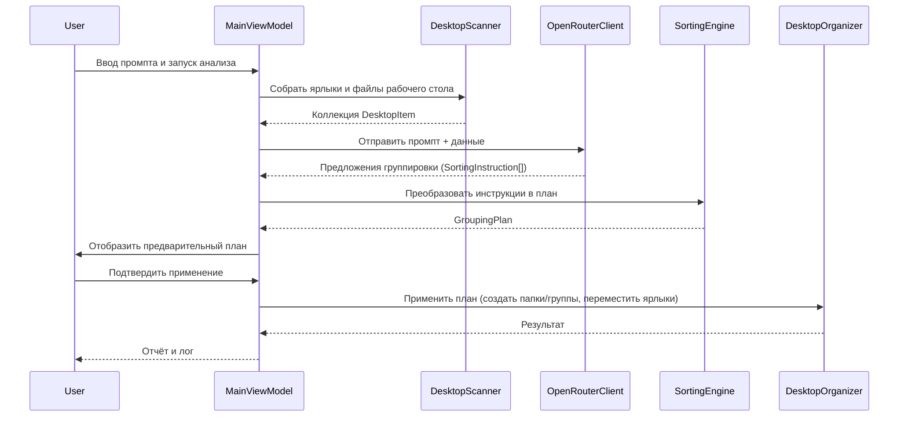

/**
 * @file: project.md
 * @description: Архитектурное описание приложения Desktop Organizer.
 * @dependencies: memory-bank/projectbrief.md, memory-bank/systemPatterns.md
 * @created: 2025-10-18
 */

# Desktop Organizer — Архитектура

## 1. Обзор решения
- **Назначение**: Организация ярлыков и файлов рабочего стола Windows на основе рекомендаций нейросети OpenRouter.
- **Пользовательский сценарий**: Пользователь запускает приложение с правами администратора, вводит промпт, инициирует анализ рабочего стола и применяет предложенную сортировку.
- **Ключевые требования**: Интеграция с OpenRouter API, работа с файловой системой Windows, логирование операций, отсутствие постоянного фонового мониторинга.

## 2. Архитектурные слои
- **Представление (UI)**: WPF-приложение (MVVM), содержит `MainWindow`, `PromptView`, визуализацию результатов и прогресса.
- **Приложение / ViewModel**: Управляет состоянием UI, orchestrates сценарием: сбор данных → вызов OpenRouter → применение сортировки.
- **Сервисный слой**:
  - `DesktopScanner` — чтение ярлыков и файлов рабочего стола, подготовка метаданных (название, тип, путь, размер).
  - `OpenRouterClient` — формирование запросов, отправка данных и промпта, обработка ответа.
  - `SortingEngine` — преобразование ответа модели в набор операций по группировке/перемещению.
  - `DesktopOrganizer` — применение операций (создание групп/папок, перемещение ярлыков).
- **Инфраструктура**: Конфигурации, хранение API-ключа (Credential Manager / зашифрованный файл), логирование (Serilog), DI-контейнер (Microsoft.Extensions.DependencyInjection).

## 3. Основные компоненты
- **Models**: `DesktopItem`, `SortingInstruction`, `GroupingPlan`.
- **Services**: `IDesktopScanner`, `IOpenRouterClient`, `ISortingEngine`, `IDesktopOrganizer`, `ILoggerService`, `ISettingsService`.
- **ViewModels**: `MainViewModel` (содержит команды `AnalyzeDesktopCommand`, `ApplySortingCommand`, `SavePlanCommand`), вспомогательные `SortingPreviewViewModel`.
- **Views**: `MainWindow`, `SortingPlanView` (предпросмотр групп), `SettingsDialog`.

## 4. Потоки данных

## 5. Управление конфигурациями и правами
- **API-ключ**: хранится в Credential Manager или зашифрованном `appsettings.json`. В приложении существует настройка проверки наличия ключа при запуске.
- **Права администратора**: приложение требует запуск с elevation (манифест + проверка при старте).
- **Логирование**: Serilog пишет в файл (например, `%AppData%/DesktopOrganizer/logs/log-.txt`) и консоль debug; уровни логирования конфигурируются.

## 6. Обработка ошибок
- Таймауты OpenRouter — повторные попытки и уведомление пользователя.
- Отсутствие доступа к файлам — фиксация в логе, предложение пропустить проблемный элемент.
- Неверный ответ модели — fallback на ручное распределение или вывод ошибки пользователю.

## 7. Расширения и последующие шаги
- Добавить шаблоны промптов и историю сортировок.
- Поддержка нескольких рабочих столов (виртуальных или пользовательских профилей).
- Интеграция с планировщиком задач Windows для ручного запуска по расписанию.
